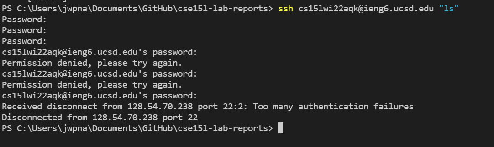

# Lab report week 2

**Installing VScode**

First you will want to install VScode, this is done by going to the following page and download:

When you have downloaded you should open it and it should look like:

**Remotely Connecting**

Next we want to connect to the external server of UCSD this can be done by typing our course specific account into the terminal with *ssh* command infront, you will then be asked for you password, type it and you should enter:

**Trying some commands**

Next we want to try some commands, the most common are cd, ls, cp, cat ...
You will want to try several of these, below is a picture of doing the ls command.

Note that I dont use the ls -a command here because I can't connect and therefore use the terminal for windows.

**Moving files with scp**

Another usefull tool is moving files from the client (your computer) to the server, this is done using the code scp, the following is an example (doesnt work for me due to my problem but same method)

**Setting an SSH key**
You start by generating a key using the command ssh-keygen, this will generate a file afterward you login again and upload the file with the public key using the scp method. But first you will create a directory inside the server using mkdir command.

**Optimizing Remote Running**
It is possible to run remote more smoothly by using combined commands for example can you run ls when you login immedietly like:

You can also use semicolons to run multiply commands like:

"cp WhereAmI.java OtherMain.java; javac OtherMain.java; java WhereAmI".
