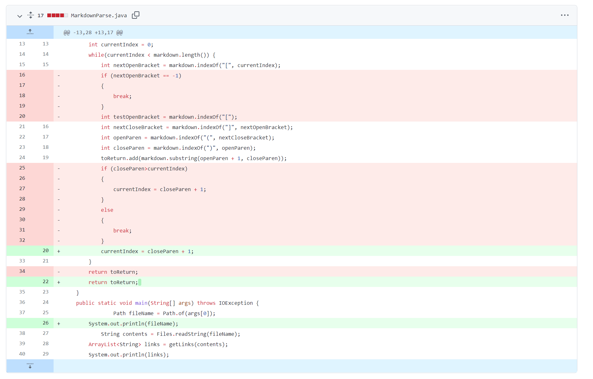
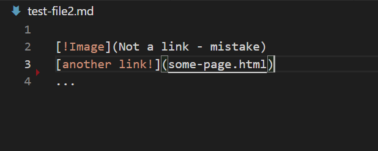
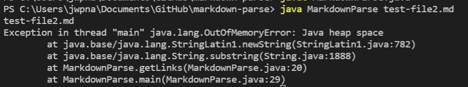
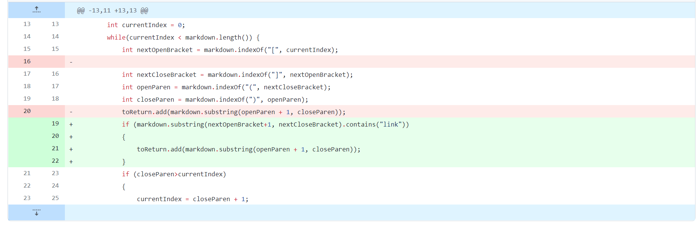
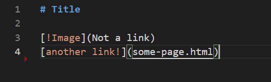
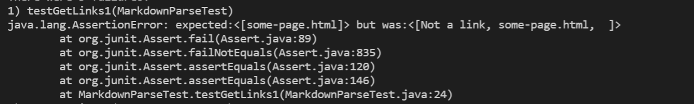
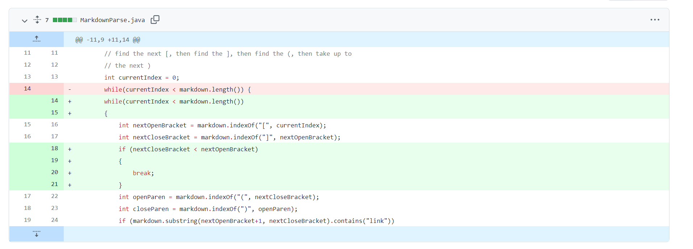
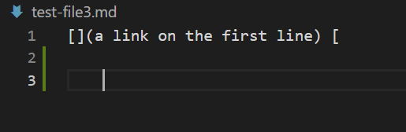
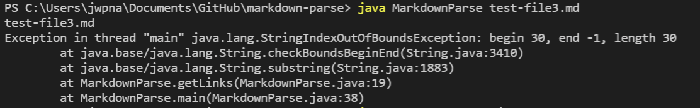

# Lab report week 2

## First code changes

The first code changes we made were:

This is because of the error that comes from the file test-file2.md:

The sympton of the failure because of the file is:

The output is a sympton of the part ... in the test-file2.md, this part creates the problem where the code cannot find the next [ and therefore keeps looping over it infinitly. The solution to the problem is shown in the code changes which is to create an if-else statement where if the ) is after the current index then its updated but if not then the else statement will catch and break the while loop so it does not become infinite.

## Second code changes

The second code changes made were:

These changes comes from the error that is the result of inputing the file 

The error that inputting the files results in is

The failure here is that the output is not the expected output, the output was [Not a link, some-page.html, ], the problem is the first and last part, the first part is an image and not a link and the last part is empty and not a real link. The solution in the code changes is to only output code where inside the brackets the word "link" is contained.

This code is depending on how we determine what is a valid link, In this change we have simply said that a link is valid as long as there is the word *link* inside, we could also have made this conditional on not having ! infront or having no spaces inside the link. 

## Third code changes

The third code changes made were:

These changes comes from the error that is the result of inputing the file 

The error that inputting the files results in is

The error is in the situation were we have an openbracket ([) but not an close bracket (]), this creates problem with the code changes made in the second code changes, the code from that is using "substring(nextOpenBracket+1, nextCloseBracket)", where the "nextCloseBracket" is behind "nextOpenBracket" and therefore throws an error, this is solved by using if statement "nextCloseBracket < nextOpenBracket" to make sure this doens't happen by break.
