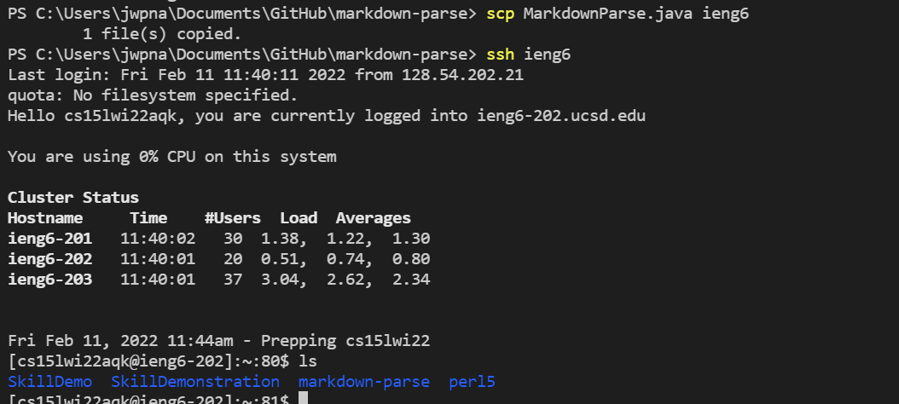

# Lab report 3 week 6

## Streamline ssh Configuration

To streamline my ssh configuration so i can just type "ssh ieng6" instead of typing the longer username, I first have to change my config file, I do this by typing:

I used the program [Atom](https://atom.io/), and then wrote the name ieng6 so when i call "ssh ieng6" it will be this that is used, then i wrote both the Host and my own user Id.

This then allows me to enter the server using just:

As can be seen typing "shh ieng6" is much easier than "ssh cs15lwi22aqk@ieng6.ucsd.edu".

Likewise this shortcut can also be used when moving files using the "scp" command, like this:

Here the file MarkdownParse.java is moved over with no problem and I then login to see that it has been copied over. 