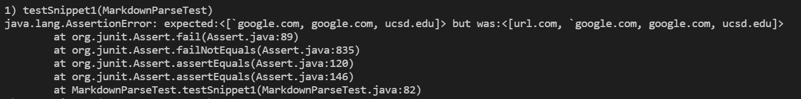
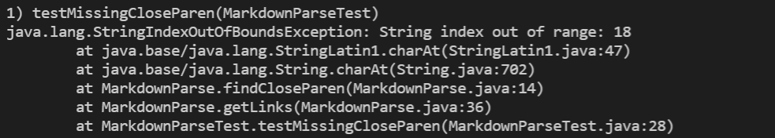
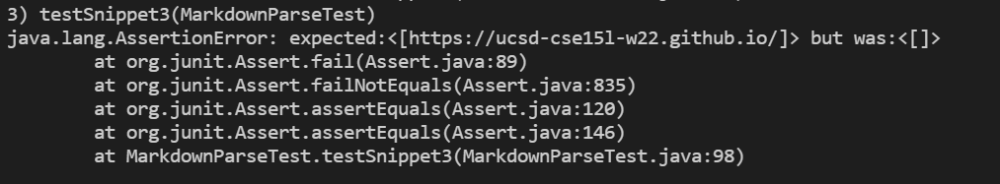
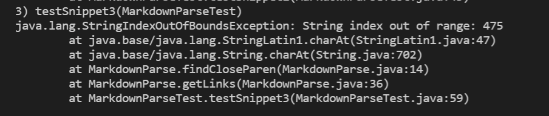

# Lab report 4 week 8

In this lab report I will be using my own [MarkdwonParse](https://github.com/JonathanWPedersen/markdown-parse) and the [reviewd MarkdownParse](https://github.com/JonathanWPedersen/markdown-parse-second).

## tests

## Snippet 1:

For snippet 1, I expect the output to be ["`google.com", "google.com", "ucsd.edu"], I dont expect "url.com", is due to the backtick that makes the text "[a link", is meant to be together and can't be split. The other are ok because there are either no backticks or both is inside the brackets.

The output is:

* MarkdownParse:

* reviewed MarkdownParse:

## Snippet 2:

For snippet 2, I exptect the output to be ["a.com", "a.com(())", "example.com"], the reason for this is that I have the case of a nested brackets, this therefore makes me expect that for the first one the inner \[nested link](a.com), its different for parentheiss which is why I expect a.com(()). 

The output is:

* MarkkdownParse:

* reviewed MarkdownParse:

Test is passed for this one.

## Snippet 3:

The expected output is ["https://ucsd-cse15l-w22.github.io/"], this is the only part because all the others hold spaces inside [] or space inside the link itself (which is not allowed)

The code outputs:

* MarkdownParse:

* reviewed MarkdownParse:

## code changes:

