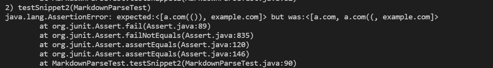

# Lab report 4 week 8

In this lab report I will be using my own [MarkdwonParse](https://github.com/JonathanWPedersen/markdown-parse) and the [reviewd MarkdownParse](https://github.com/JonathanWPedersen/markdown-parse-second).

## tests

The tests I created to test each is:

It is the same for both.

## Snippet 1:

For snippet 1, I expect the output to be ["`google.com", "google.com", "ucsd.edu"], I dont expect "url.com", is due to the backtick that makes the text "[a link", is meant to be together and can't be split. The other are ok because there are either no backticks or both is inside the brackets.

The output is:

* MarkdownParse:

* reviewed MarkdownParse:

## Snippet 2:

For snippet 2, I exptect the output to be ["a.com", "a.com(())", "example.com"], the reason for this is that I have the case of a nested brackets, this therefore makes me expect that for the first one the inner \[nested link](a.com), its different for parentheiss which is why I expect a.com(()). 

The output is:

* MarkkdownParse:

* reviewed MarkdownParse:

Test is passed for this one.

## Snippet 3:

The expected output is ["https://ucsd-cse15l-w22.github.io/"], this is the only part because all the others hold spaces inside [] or space inside the link itself (which is not allowed)

The code outputs:

* MarkdownParse:

* reviewed MarkdownParse:

## code changes:

For snippet 1, the problem for both is that the link "url.com" is outputted, this can be solves relativly simply be making it so that if we hit a backtick, then all code from that backtick to the next will be its own seperat when it comes to creating links, so if it creates its own link it will output but if its between like for "url.com" it wont. This can be done by creating a variable `int backtick` and then if `backtick != -1` finding the next one and treating everyone between as one unit. This will also require some changes to the other parts.

For snippet 2 the reviewed passes the test, but my own does not, this is because my own does not take into account that parenthesis also need to belong to each but simply takes the first the best. The solution to this is to also create a helper method for this that takes into account that the "end parenthesis" has to be the partner of the "open paranthesis" that starts the link for it to be the end and all other are to be treated as part of the link.

For snippet 3 the problem is spaces and new lines inside the parenthesis. The solution to this is to create code that can be "trim" the spaces and new lines inside the parenthesis. But not spaces inside the link, because in that case the link is invalid. 
