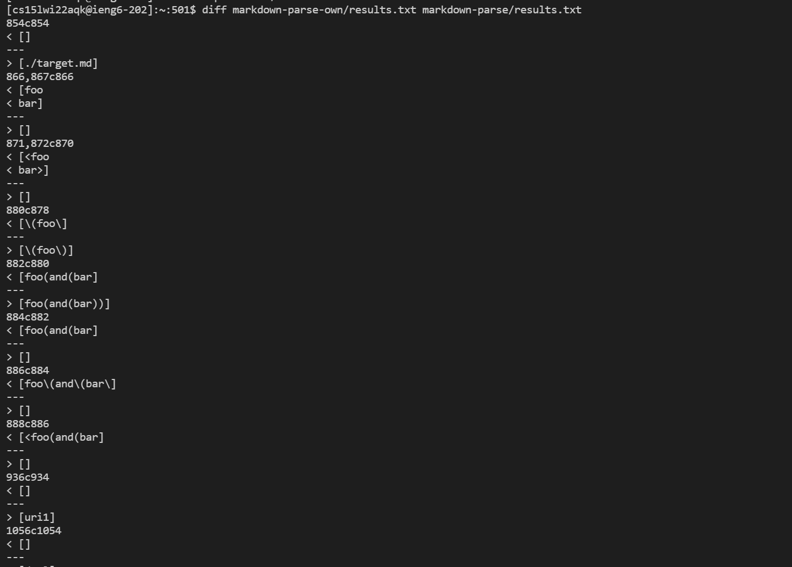
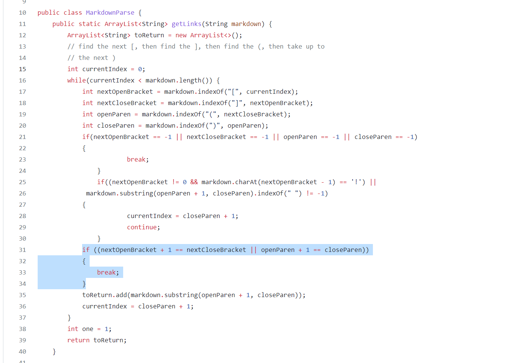

# Lab report 5 week 10

To get a overview I use the provided script to run all the tests at once and furtheremore I use the code `bash script.sh > results.txt`, to copy the result into a text file, I do this for both my own code and for the code provided. 

Once this is done I use the command `diff` to compare the two txt files and find the parts that are difference, when doing this I get:

As can be seen there are several code parts that do not match, I look at the part 854c854 and 880c878 and find out what kind of problem there is and how to fix it.

## Problem 1:

My own code gave the result `[]` and the given code gave `./target.md`, I expected the reuslt to be `./target.md` so I need to change my own code in MarkdownParse, more specifically it is this part:

As can be seen the problem is in the highlighted part, the easy correction here is to simply remove the part `nextOpenBracket + 1 == nextCloseBracket`. 

[link](\(foo\))

## Problem 2:

For problem 2, my own code gives the result `[\(foo\]` and the provided code is `[\(foo\)]`. The correct code is the last one since it is the same that .md does. 

